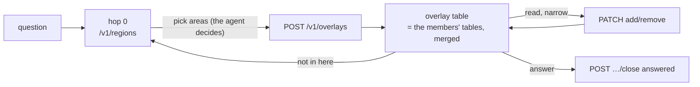

# Overlay — a run's working set (VRF)

Status: **built** 2026-09-11 — direction approved by the operator, reviewed and implemented by the
Knowledge session (`/v1/overlays`, 0fda554), consumed by the proxy, the map and the MCP server. Not yet
done: the ten-question comparison at the bottom, and the curator reading closed records.


## Why

Today an overlay exists only when a person ticks areas on the map, and only reaches an agent through
a launch URL (`?root=…`). An agent that finds its own way through the ontology leaves no trace of
*which* areas it chose or *why* — the choice is buried in tool calls inside one conversation.

The operator's flow makes that choice an object:

1. **List the targets.** A question arrives. The agent reads hop 0 (the Back-Bone's list) and picks
   the areas the question belongs to.
2. **Draw the VRF.** The agent asks the API to create an overlay from them. The map draws it.
3. **Work inside it.** From then on the agent answers from the overlay's table — narrowing to nodes as
   it reads, leaving it only by going back to hop 0.

One object, two authors: a person ticking areas on the map and an agent calling the API create the
same thing, and the map draws either.



## Four rules

**The agent decides what goes in it.** RouteMind has no model of its own for this: it serves the
tables, refuses an address that resolves to nothing and an overlay over its caps, and keeps the
record — which rows a question belongs to is never its judgment. The picking is done by whatever model
is driving the MCP client, from the `use_when` lines alone. A person can draw one too, by ticking
areas on the map and pressing **Draw VRF**; both make the same object, and the map draws either.

1. **Absence is still decided at hop 0 only.** An overlay narrows where to look; it does not change
   what exists. "Not in the overlay" never means "not in RouteMind" — the agent goes back to hop 0.
   That return is budgeted: **at most 3 per run**, or an agent shuttles between areas. The budget is
   in the agent's instructions, not the API: going back is `GET /v1/regions`, which carries no overlay
   and cannot be attributed to a run, so an API count would be a count of something else. The API
   records; `trail` shows a run that shuttled.
2. **An overlay is run evidence, not ontology.** It belongs to one question. It is **never committed to
   the ontology repository** — that tree holds structure, and a commit per question would bury it.
   It lives in a runtime store, expires, and on close leaves a small record of what was used.
3. **The API checks, it does not choose.** Picking is the agent's (or the person's). The API refuses
   an address that **does not resolve** to anything it serves, and an overlay over its caps. It cannot
   refuse an address that was assembled rather than read — nothing records what was printed, so a
   correct guess passes. The rule for agents is unchanged (follow `fetch`, never assemble); the API
   simply does not claim to enforce it.
4. **Every change says why.** Creating, adding, removing: each carries a reason. Without it the record
   says what happened and not what the agent thought, and it is the second that is worth learning from.

## The object

```json
{
  "id": "ov_2026-09-11_7f3a",
  "question": "which courier is late on parcel 1234, and what does the SLA say",
  "by": {"kind": "agent", "name": "claude-code"},
  "state": "open",
  "members": [
    {"address": "/v1/regions/order-delivery", "why": "couriers and delivery promises", "at": "…"},
    {"address": "/v1/nodes/courier-sla",      "why": "the SLA itself",                 "at": "…"}
  ],
  "trail": [
    {"op": "create", "address": "/v1/regions/order-delivery", "why": "…", "at": "…"},
    {"op": "add",    "address": "/v1/nodes/courier-sla",      "why": "…", "at": "…"}
  ],
  "outcome": null,
  "used": []
}
```

A member is any address the ontology prints: an area (`/v1/regions/<dir>`), an entity
(`/v1/nodes/<id>`), or a document (`/v1/nodes/<id>/body`).

## The API

| Call | Does | Refuses |
|---|---|---|
| `POST /v1/overlays` `{question, members:[{address, why}], by}` | creates it; answers `201` with the object and its rows | an address that does not resolve (422, naming it) · over a cap (409) · no `why` or no `question` (400) |
| `GET /v1/overlays/{id}` | the object and its **rows** — the members' tables merged, what an agent picks from next | unknown id (404) |
| `PATCH /v1/overlays/{id}` `{add\|remove: address, why}` | narrows or widens; appends to `trail` | closed (409) · same refusals as create |
| `POST /v1/overlays/{id}/close` `{outcome: answered\|not_found, used:[address]}` | ends it; keeps the record. Each `used` address is recorded as `member` or `reached` | an address that does not resolve (422) |
| `GET /v1/overlays?state=open` | what the map draws | — |

`used` takes addresses that were never members, on purpose. Narrowing happens by reading: an agent
adds an area, follows a row to a document, answers from it. **"Answered from something that was never
a member" is signal, not error** — the overlay was drawn a level too coarse — and it is exactly what
the comparison below is trying to learn.

`question` is required from a person too. Someone ticking areas has not typed one, so the map asks
"what are you looking at?" — which makes a person's overlay as learnable as an agent's. A field whose
rules depend on who is calling is the kind that rots.

The **rows** are what the overlay is for. The API returns data, not text: `_table()` in
`mcp/knowledge_mcp.py` is the one renderer and the absence footer lives there, and a second author of
the same format would drift from it. The API sends `absence` as a flag the renderer honours. Rendered,
it reads the way a routing table reads today —
kind, address, why you would pick this row — with every member's rows under its own heading, and the
same footer as any table below hop 0: *not finding it here means go back to hop 0, not that it does
not exist*.

Proposed payload (final shape from the Knowledge session): one section per member, in member order. A section's `rows` have exactly the
shape of an area's `entries[]` today, so every consumer that reads a table already reads them:

```json
"table": [
  {"member": "/v1/regions/order-delivery", "why": "couriers and delivery promises",
   "title": "ORDER_DELIVERY — Order delivery",
   "rows": [{"id": "courier-sla", "name": "courier-sla", "one_liner": "…", "type": "dr",
             "has_body": false, "children": 1, "fetch": "/v1/nodes/courier-sla"}]},
  {"member": "/v1/nodes/sla/body", "why": "the SLA itself", "title": "sla",
   "rows": [{"id": "sla", "name": "sla", "one_liner": "…", "type": "data",
             "has_body": true, "children": 0, "fetch": "/v1/nodes/sla/body"}]}
]
```

One level per member, never a subtree: an area contributes its own rows, an entity its children, a
document the one row that is itself.

**Consumers find out whether overlays exist by asking.** `GET /v1/overlays` answering 404 or 501
(`ONTOLOGY_OVERLAYS` unset) means this install has none, and the MCP server and the map behave exactly as they do today — no tool, no
drawing, no "Draw VRF". Nothing on the consumer side depends on the producer having landed.

Caps: 8 members **and 120 rows**. Eight areas of twenty-five rows each is a table handed to an agent
that asked to narrow. Over the row cap, create and add are **refused, naming the member that did it**
("add entities instead of the whole area") — never truncated, because a truncated table would make
"not here" false and break rule 1.

Expiry: an open overlay untouched for 24 h becomes `abandoned`; closed records are kept 30 days.
**Evaluated lazily, on every read and write — no scheduler, no thread.** An abandoned overlay is
marked when someone next looks, which is when it matters. All four numbers are settings.

## Where each part lives

| Part | Owner | What |
|---|---|---|
| `/v1/overlays`, the store, address checks, the merged rows, the record | **Knowledge** | `ontology/service/`, storing under `ONTOLOGY_OVERLAYS` — its own path: not inside `data/repo` (structure), not under `publish/` (a checkout swapped atomically and mounted read-only elsewhere). Unset → `501` |
| proxy `/api/knowledge/overlays*` | Web | same shapes, same refusals passed through |
| MCP | Web | a tool `knowledge_overlay {op: create\|get\|add\|remove\|close, …}`; the `instructions` on connect describe the flow above |
| map | Web | open overlays drawn on the areas and tiles they hold, with who made it; the tick boxes create a person's overlay through the same `POST` |
| compose / install | Platform | the store's volume and the two settings |
| checks | Web | write-paths-style checks on a throwaway tree; a browser check for the drawing |

## Not in the first version

- **Approval between drawing and working.** The overlay is shown, not gated. A person can edit it on
  the map while it is open; the agent reads the new table on its next call.
- **The curator learning from closed overlays.** The record is shaped for it (`why`, `used`,
  `outcome`), but reading it is a later step.

## How we will know it helped

The same ten questions or fewer, run twice: once as agents work today, once through overlays. Count
the calls to reach an answer and how many were reached at all. If the overlay costs calls without
reaching more, the flow is wrong, not the counting.
